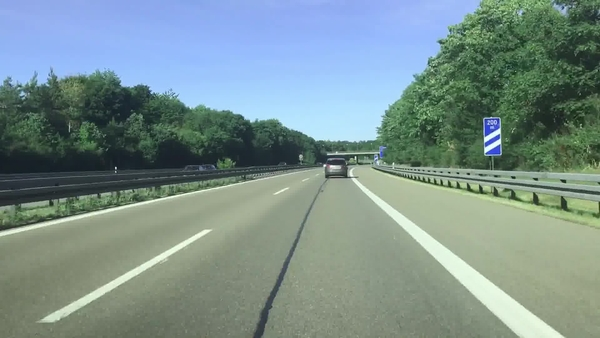
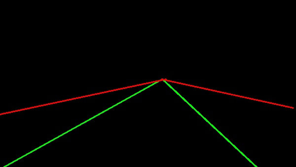

# Lane Detection using OpenCV

This repository contains an implementation of road lane detection using OpenCV. The detection algorithm is designed to work with a base image included in the repository.

## Introduction
Lane detection plays a crucial role in various applications such as autonomous vehicles, advanced driver assistance systems (ADAS), and road safety monitoring. This project aims to detect road lanes using computer vision techniques.

## Input Image

## Steps Involved
The lane detection process consists of the following steps:

1. **Loading the Image**: Load the base image for lane detection.
2. **Color Space Conversion**: Convert the image from RGB to HSV color space.
3. **Region of Interest Extraction**: Use masking to extract the region of interest containing the road lanes.
4. **Grayscale Conversion**: Convert the masked image to grayscale for further processing.
5. **Smoothing the Image**: Apply Gaussian blur to reduce noise and smoothen the image.
6. **Edge Detection**: Use edge detection techniques to detect edges in the image.
7. **Hough Line Transform**: Utilize the Hough Line Transform method to detect lines representing road lanes.
8. **Analysis of Detected Lines**: Analyze the detected lines to find their slopes and lengths.
9. **Line Sorting**: Sort the lines based on their lengths.
10. **Line Extension**: Extend the lines to a specified y-intercept to ensure complete lane coverage.
11. **Duplicate Line Removal**: Remove duplicate lines with similar slope inclination to avoid redundancy.
12. **Color Coding**: Color the lane lines, with the extreme lines (end of the lane) marked in red for better visualization.

## Results
The repository includes an output image showing the detected lane lines for comparison. The effectiveness of the lane detection algorithm can be observed through this visual representation.

## Output Image

## Requirements
The project relies on the following libraries:
- OpenCV
- NumPy

## Usage
To use the lane detection algorithm:
1. Clone the repository to your local machine.
2. Ensure you have Python installed, along with the required libraries.
3. Run the provided code or integrate the lane detection algorithm into your project.

## Conclusion
Lane detection using computer vision techniques is an essential component of modern transportation systems. This project demonstrates a straightforward yet effective approach to detect road lanes using OpenCV, offering potential applications in various domains.

Feel free to explore the code, experiment with different parameters, and contribute to further improvements!

## License
This project is licensed under the [MIT License](LICENSE).
